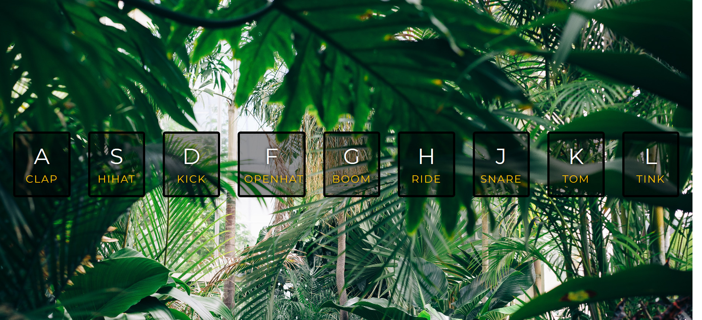
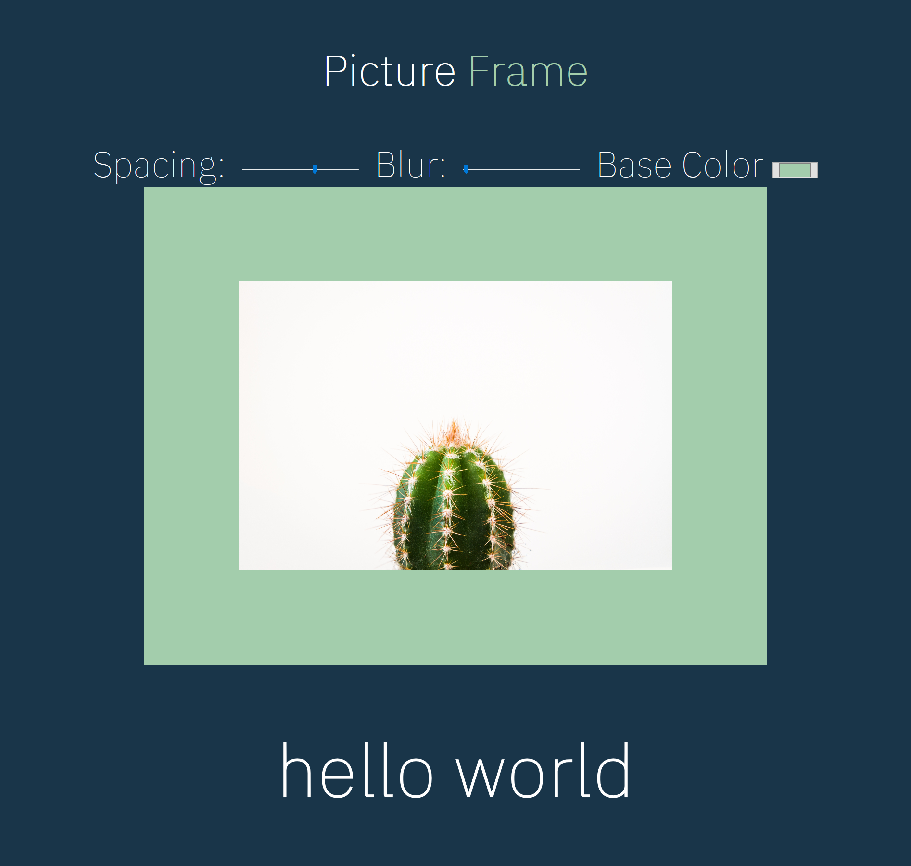

# thirty-days-of-JS
Making some cool mini projects only with vanilla JavaScript and Wes Bos. 
```
Remembering JavaScript without any frameworks or libraries...
```
## Day 1 - Drumkit April 27,2018



* adding classes and attributes without jQuery
* classList
* template literals
* couldn't resist google fonts though

## Day 2 - JS and CSS Clock April 30, 2018


* first try using CSS grid to make sticky footer
* changing the axis of rotation on a css element
* template literals
* using JavaScript Date object
* transition-timing-function: using cubic-bezier tool
* remember to give credit for free photos

## Day 3 - CSS Variables and JS May 3, 2018



* CSS variables :root
* learning syntax and usage
* template literals reinforcement
* using data-type attributes
* input type="color" will give you browsers color picker
* CSS is so cool, I don't care what you say!