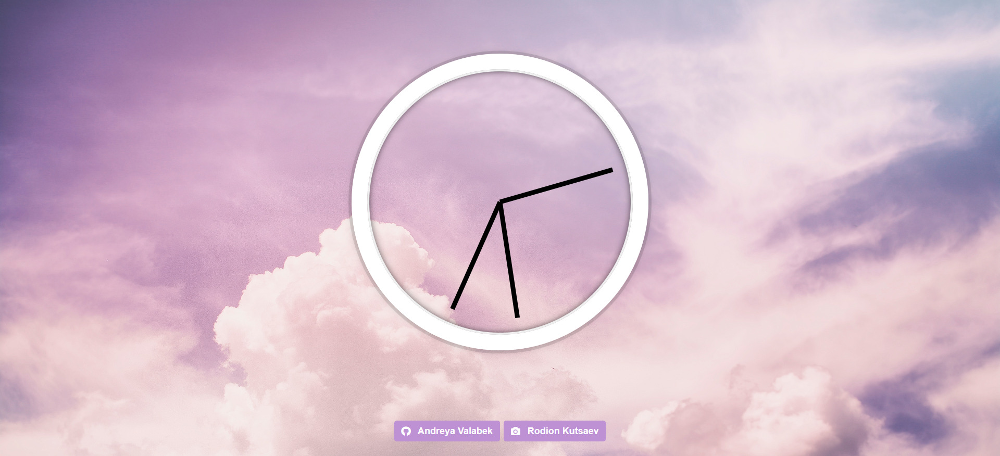
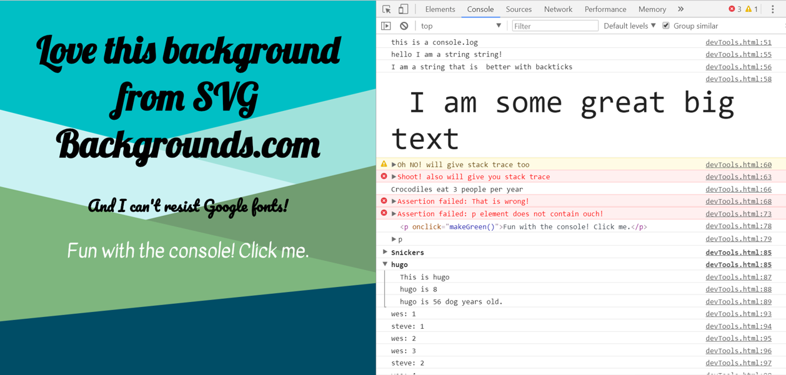

# thirty-days-of-JS
Making some cool mini projects only with vanilla JavaScript and Wes Bos. 
```
Remembering JavaScript without any frameworks or libraries...
```
## Day 1 - Drumkit April 27,2018


* adding classes and attributes without jQuery
* classList
* template literals
* couldn't resist google fonts though

## Day 2 - JS and CSS Clock April 30, 2018



* first try using CSS grid to make sticky footer
* changing the axis of rotation on a css element
* template literals
* using JavaScript Date object
* transition-timing-function: using cubic-bezier tool
* remember to give credit for free photos

## Day 3 - CSS Variables and JS May 3, 2018


* CSS variables :root
* learning syntax and usage
* template literals reinforcement
* using data-type attributes
* input type="color" will give you browser's color picker
* CSS is so cool, I don't care what you say!

## Day 4 - Map, Filter, Reduce and Sort array methods May 4, 2018


* workout with array methods
* reinforce map, filter
* reinforce syntax for arrow functions
* I love ternary operators.
* learn reduce and sort
* practice template literals
* console.table -- who knew?

## Day 5 - Flex Panel fun with CSS May 9, 2018


* using transitions to animiate in CSS
* translateY to move things
* CSS syntax >* for example
* this is so much cooler than sliders and just it's just CSS!
* conversion to gif made dog's white background pixelated in demo

## Day 6 - Type Ahead: Search and highlight cities using fetch() May 10, 2018


* learn about new fetch() API to get resources to browser
* learn a little about how to use regular expressions
* promises (fetch returns a promise)
* reinforce map and filter
* practice template literals

## Day 7 - Array Cardio .some .every .find .findIndex May 11, 2018


* learn about .some .every .find .findIndex array methods
* more reinforcement of arrow function syntax
* It doesn't need a front end but I like pretty pictures.
* taking advantage of implicit return in arrow functions
* using the spread operator outside of React

## Day 8 - HTML Canvas May 11, 2018


* first time using HTML canvas
* using hue to create rainbow gradient
* adjusting the width of the pen to go up and down through a range
* two mini projects in one day!
* learn command to preview markdown files in VSCode

## Day 9 - Dev Tools May 17, 2018


* learn about console.warn .error .info .assert .log(element) .dir(element) .group .count .time
* who knew what the console could do!
* using the new fetch() API some more
* more template literal practice--I get it now!
* you can use @import within style tags to import css like links to google fonts
* svgbackgrounds.com has really cool backgrounds!

## Day 10 - Checkboxes tick multiple hold shift May 17, 2018


* make checkboxes select all those between shift-tick
* inbetween = !inbetween
* using @import again 
* customize svgbackground colors
* use console.log to check along the way
* remember to stop and check after each step
* I understand the explanation of this one but was tough going on my own(didn't get there)

## Day 11 - Custom video player May 25, 2018


* passive learning on this one
* learned how to make a css gradient background
* practice using querySelector s
* using lots of events
* more template literals
* can simply cut and paste icons into file to use
